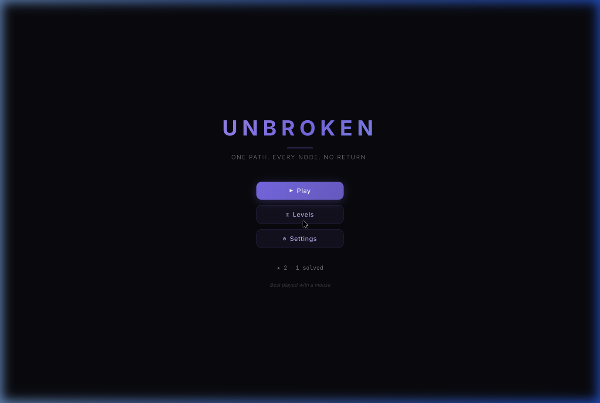
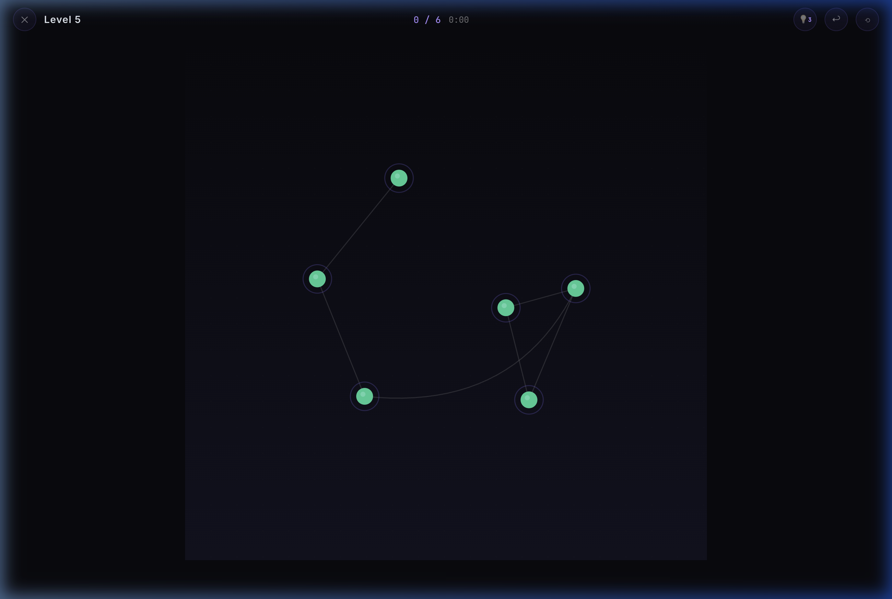
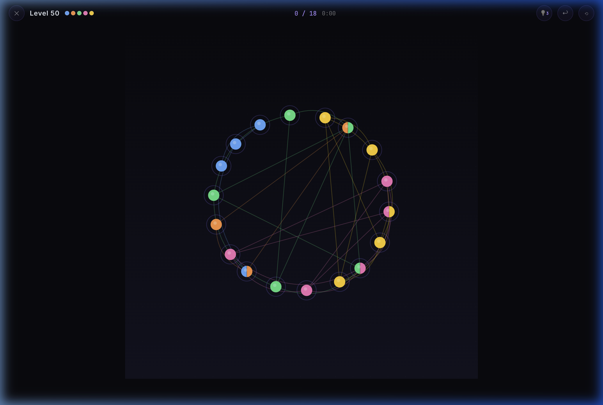
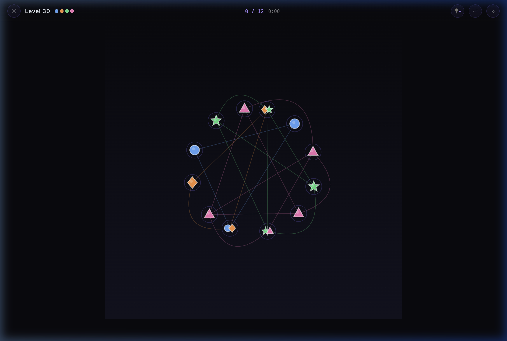
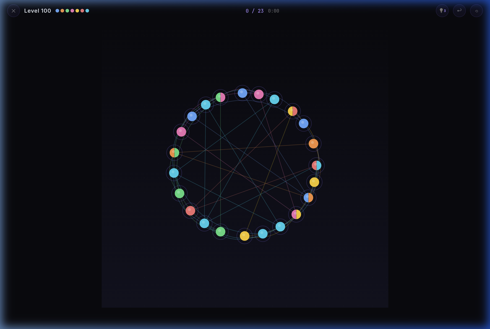
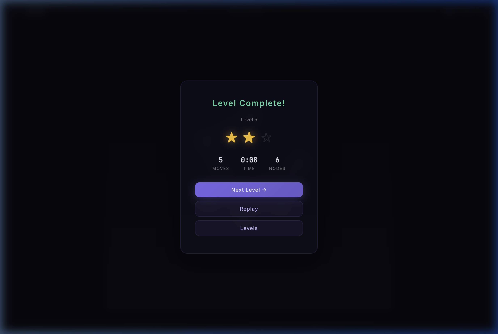
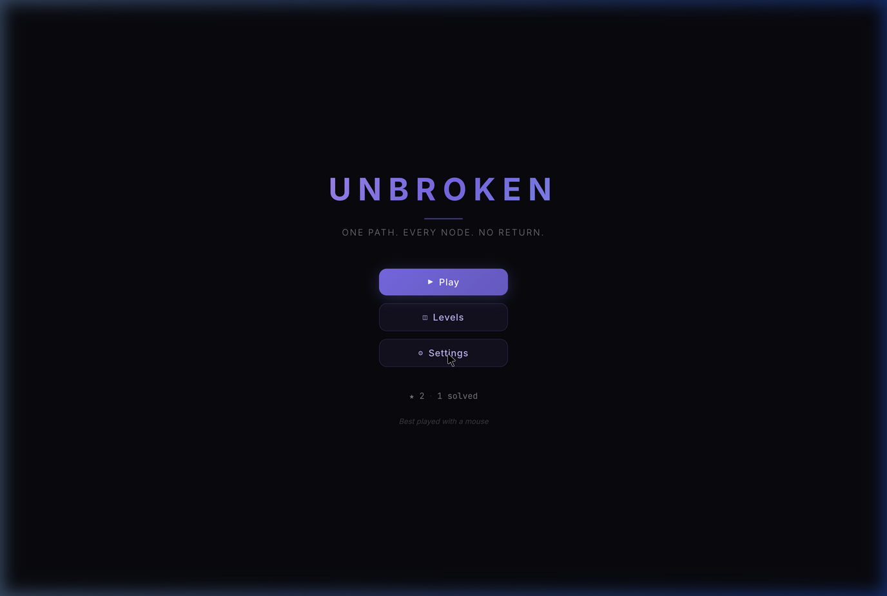

<div align="center">

# 🔗 UNBROKEN

### ✦ One Path. Every Node. No Return. ✦

An infinite procedural puzzle game where you trace a Hamiltonian path through every node — but each node can only be visited once, and there's no going back.

[](https://hoormazd1379.github.io/Unbroken/)
[](https://github.com/Hoormazd1379/Unbroken/releases)
[](LICENSE)

<br>



</div>

---

## 🎮 Screenshots

<div align="center">
<table>
<tr>
<td><br><sub><b>Early Levels</b> — Simple shapes to learn the mechanics</sub></td>
<td><br><sub><b>Multi-Color Puzzles</b> — Navigate color-compatible edges</sub></td>
</tr>
<tr>
<td><br><sub><b>High-Contrast Mode</b> — Unique shapes per color for accessibility</sub></td>
<td><br><sub><b>Advanced Levels</b> — 20+ nodes with engineered traps</sub></td>
</tr>
<tr>
<td><br><sub><b>Victory!</b> — Time-based star rating system</sub></td>
<td><br><sub><b>Settings</b> — Accessibility & free play options</sub></td>
</tr>
</table>
</div>

---

## ✨ Features

| | Feature | Description |
|---|---|---|
| 🧩 | **Infinite Levels** | Every puzzle is procedurally generated from a seeded PRNG — each level is unique and deterministic |
| 🎨 | **Color Mechanics** | Up to 10 node colors — you can only traverse edges between color-compatible nodes |
| 🌉 | **Bridge Nodes** | Split-colored nodes force you to enter on one color and exit on another |
| 🪤 | **Engineered Traps** | Dead-end forks, cycle injections, articulation points, decoy paths, color bottlenecks & parity traps |
| 🎵 | **Adaptive Audio** | Beat-synchronized generative music that reacts to your moves — energy/valence system drives chord progressions, 7 vertical layers, and dynamic BPM |
| 🌈 | **Mood Aura** | A living screen vignette that breathes and shifts color with the music's energy and emotional valence |
| ♿ | **High-Contrast Mode** | Colorblind-friendly with unique geometric shapes per color (◆ ★ ▲ ■ ⬡ ⬠ ✚ ♥ ↑) |
| ⏱️ | **Time-Based Stars** | Earn up to 3 stars: ≤1.5s/node = ★★★, ≤2.5s/node = ★★ |
| 💡 | **Smart Hints** | 3 hints per level with DFS backtracking solver (unlimited in Free Play) |
| 🔓 | **Free Play Mode** | Unlock all levels and unlimited hints via Settings |
| 📱 | **Responsive** | Works on desktop and mobile with touch support |

---

## 🕹️ How to Play

```
1. 🖱️  Click any node to start your path
2. ➡️  Click adjacent nodes to extend — each node can only be visited once
3. 🎯  Visit every node to complete the level
4. 🎨  Watch for colored edges — move between nodes that share a color
5. 🌉  Bridge nodes (split-colored) change your active color
6. ↩️  Use Undo or ⟲ Reset if you get stuck
7. 💡  Use Hints sparingly — you only get 3!
```

### ⌨️ Keyboard Shortcuts

| Key | Action |
|-----|--------|
| `H` | Show hint |
| `U` or `Ctrl+Z` | Undo last move |
| `R` | Reset level |
| `D` | Toggle audio debug panel |
| `Esc` | Pause menu |

---

## 🛠️ Tech Stack

<div align="center">


</div>

- **Zero dependencies** — No frameworks, no build tools, no npm
- **HTML5 Canvas** — All rendering via Canvas 2D API
- **Web Audio API** — Entirely synthesized adaptive music engine
- **ES Modules** — Clean modular architecture (13 files)
- **LocalStorage** — Progress saved in the browser
- **Seeded PRNG** — Deterministic level generation (Mulberry32)

---

## 📁 Project Structure

```
Unbroken/
├── index.html              Entry point
├── style.css               Glassmorphism dark theme
├── README.md
├── screenshots/            README screenshots
└── src/
    ├── main.js             App init & game loop
    ├── config.js           Configuration & constants
    ├── audio.js            Adaptive audio engine (energy/valence system)
    ├── levelgen.js         Procedural level generation & trap engineering
    ├── puzzle.js           Puzzle state & move validation
    ├── renderer.js         Canvas rendering (shapes, curves, effects)
    ├── graph.js            Undirected graph data structure
    ├── input.js            Mouse & touch input handling
    ├── ui.js               DOM-based UI screens
    ├── effects.js          Particles, animations, screen shake
    ├── state.js            Screen state machine
    ├── save.js             localStorage persistence
    └── rng.js              Seeded PRNG (Mulberry32)
```

---

## 🚀 Run Locally

No build step required:

```bash
git clone https://github.com/Hoormazd1379/Unbroken.git
cd Unbroken
python3 -m http.server 8080
```

Then open [`http://localhost:8080`](http://localhost:8080) in your browser.

---

## 📊 Difficulty Progression

| Level Range | Nodes | Colors | Traps |
|---|---|---|---|
| 1–5 | 4–6 | 1 | None |
| 6–15 | 6–9 | 1–2 | Dead-end forks |
| 16–30 | 9–13 | 2–4 | + Cycles, articulation points |
| 31–60 | 13–18 | 4–6 | + Decoy paths, color bottlenecks |
| 61–100 | 18–23 | 6–8 | + Parity traps |
| 100+ | 23–28 | 8–10 | Full trap suite |

---

<div align="center">

## 📜 License

MIT © [Hoormazd1379](https://github.com/Hoormazd1379)

---

Made with 💜 and a lot of graph theory

[](https://github.com/Hoormazd1379/Unbroken)

</div>
